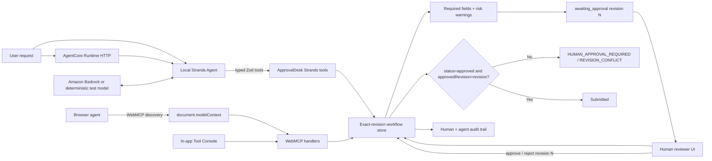

# Architecture

ApprovalDesk deliberately has multiple agent interfaces but one workflow authority.

## Strands agent loop

The AWS-oriented path is a real `@strands-agents/sdk` `Agent`:

1. the model selects an ApprovalDesk tool;
2. Strands validates and executes the typed tool;
3. the tool mutates or reads the shared domain store;
4. the tool result returns to the model;
5. the loop continues through create → fill → validate → request approval;
6. once the exact draft is awaiting approval, the agent stops instead of simulating a human decision; and
7. a later invocation can resume only after the store records a real human approval.

The deterministic test model exists only to make this orchestration repeatable without external credentials. It still drives the Strands `Agent.invoke()` loop and real tool executor.

## AgentCore Runtime boundary

`src/agentcore/server.ts` adapts the same Strands agent to the Amazon Bedrock AgentCore Runtime HTTP protocol:

- `GET /ping` is the health endpoint;
- `POST /invocations` accepts a prompt and invokes a fresh Strands conversation;
- workflow state and exact human approvals remain owned by the existing ApprovalDesk store;
- no AWS resource, IAM role, account ID, region, or deployed Runtime is fabricated in local configuration.

`bun run build:agentcore` bundles `src/agentcore/main.ts` with esbuild for a Node 22 deployment entrypoint at `dist-agentcore/app.cjs`.

## Authority boundaries

- `src/store.ts` owns state transitions, revision checks, and the human-approval gate.
- `src/agent/approval-tools.ts` adapts that authority into Strands tools.
- `src/agent/approval-agent.ts` owns agent instructions and orchestration, not workflow truth.
- `src/agentcore/server.ts` owns only the AgentCore HTTP transport boundary.
- `src/webmcp.ts` adapts the same domain transitions into WebMCP tools.
- `src/App.tsx` adapts the same transitions into a human UI and demo Tool Console.
- No UI-only, WebMCP-only, Strands-only, or AgentCore-only submission bypass exists.

The public web demo uses `localStorage` for browser persistence so it can remain a zero-account static deployment. The Node-side Strands/AgentCore path can run without browser storage while preserving the same domain rules. A production multi-instance AgentCore deployment would replace that persistence adapter with a durable server-backed store before relying on cross-instance approval state; this repository does not pretend local in-process persistence is horizontally durable.
