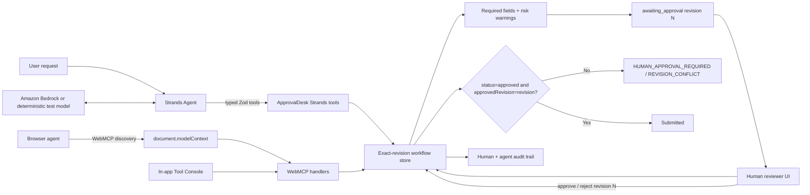

# Architecture

ApprovalDesk deliberately has multiple agent interfaces but one workflow authority.

## Strands agent loop

The AWS-oriented path is a real `@strands-agents/sdk` `Agent`:

1. the model selects an ApprovalDesk tool;
2. Strands validates and executes the typed tool;
3. the tool mutates or reads the shared domain store;
4. the tool result returns to the model;
5. the loop continues through create → fill → validate → request approval;
6. once the store reports `awaiting_approval`, the system prompt requires the agent to end its turn and surface the decision to the human;
7. approval is a human-only state transition outside that invocation; and
8. a later invocation re-reads the draft and may submit only the exact approved revision.

`src/agent/approval-agent.test.ts` drives this full loop through `Agent.invoke()` using a deterministic `Model`. This is not a mock of the domain functions: Strands still performs tool selection, tool execution, tool-result feedback, and turn termination. The deterministic provider makes the authority behavior verifiable without AWS credentials.

## Authority boundaries

- `src/store.ts` owns workflow state transitions, optimistic revision checks, approval invalidation, and the final human-approval gate.
- `src/agent/approval-tools.ts` adapts the store into Zod-typed Strands tools.
- `src/agent/approval-agent.ts` owns agent policy and orchestration, not approval authority.
- `src/webmcp.ts` adapts the same store into browser-native WebMCP tools.
- `src/App.tsx` is the human review surface and WebMCP demo console.
- No model provider, tool adapter, UI action, or browser surface has a separate submission authority.

## Persistence and deployment

The static web demo uses `localStorage`. Node-side Strands runs reuse the same state machine even when browser storage is unavailable. A production multi-user deployment should replace persistence with a durable service while retaining `src/store.ts` semantics as the authority contract.

Amazon Bedrock is the Strands SDK's default production model path when AWS credentials are configured. Amazon Bedrock AgentCore is a suitable future hosted runtime, but the repository does not claim an AgentCore deployment until one has been live-verified.
