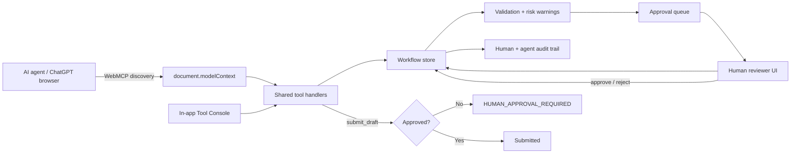

# Architecture

## Authority boundaries

- `src/store.ts` owns state transitions and the human-approval gate.
- `src/webmcp.ts` adapts those transitions into WebMCP tools.
- `src/App.tsx` adapts the same transitions into a human UI and demo Tool Console.
- No UI-only or agent-only bypass exists for submission.

The hackathon build uses localStorage so it can be deployed as a static site with no account setup. The store boundary can later be replaced with a server-backed audit store without changing tool semantics.
